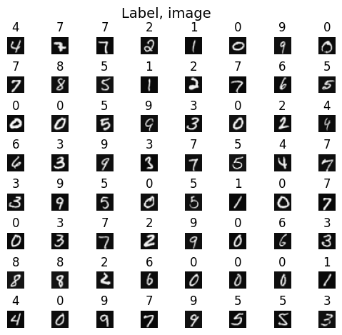
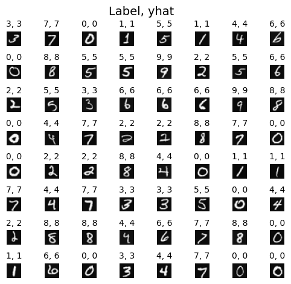
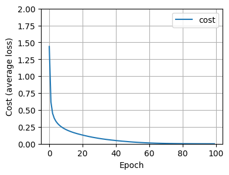

## Handwritten Digit Recognition using a Neural Network

### Training Dataset with Labels

### Label v/s Prediction (yhat) of Handwritten Digit Recognition Model using a Neural Network

### Cost v/s Epoch for the Neural Network

### References

[1] Keras Sequential Model: https://keras.io/guides/sequential_model/

[2] TensorFlow API for Python: https://www.tensorflow.org/api_docs/python/tf

## Citation

Please note that the code and technical details made available are for educational purposes only. The repo is not open for collaboration.

If you happen to use the code from this repo, please cite my user name along with link to my profile: https://github.com/balarcode. Thank you!
